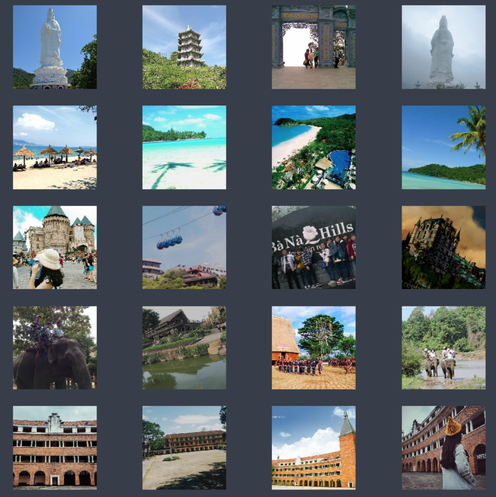

## Mô hình cơ bản cho cuộc thi Zalo Landmark Identification

### Bài toán
Dự đoán địa điểm khi nhìn vào một bức ảnh chụp tại một điểm du lịch ở Việt Nam. 

### Dữ liệu
* 103 class: Ảnh các điểm du lịch ở Việt Nam, 480 x 480 
* TrainVal (với label) : 88246. _Các label ở dạng số, không có tên địa điểm tương ứng_
* Public test (không label) :14359
* Evaluation metric: top3 error 

#### Một vài ảnh mẫu ở 5 class đầu tiên:

#### Một vài quan sát
* Có 26 ảnh ở TrainVal bị lỗi, lúc training có thể bỏ qua các ảnh này. 
* Có 3 ảnh ở Public bị lỗi, lúc nộp hơi báo lỗi vì file .csv thiếu ba dòng. Mình cho thêm ba dòng bằng `1, 0 0 0` vào để có thể nộp. Mặc nhiên ba dòng này sẽ bị sai, nhưng không ảnh hưởng nhiều tới kết quả. 

### Mô hình 

* Finetuning với ResNet 18
* Ảnh đầu vào được convert thành 224x224 để hợp với đầu vào của ResNet
* Chia 90% cho training set, 10% cho validation set
* 2 GPUs
* 30 epochs
* **Top 1 error: 0.0484, Top 3 error: 0.0085**

Kết quả tương đối tốt. 

First submission cho tập Public: **Top 3 error: 0.01859.**

Như vậy tập dữ liệu này tương đối dễ. Chỉ với finetuning đã đạt được kết quả rất tốt. 

### Một số ý tưởng

1. Thử mô hình với các ResNet nhiều layer hơn (34, 50, 152). 
Mình đã thử nhưng chạy rất chậm, và kết quả giờ đã khá tốt rồi nên không muốn thử tiếp nữa. 

2. Thay đổi fully connected layer ở cuối sao cho ResNet có thể nhận đầu vào là 480x480. 
Tuy nhiên, thời gian huấn luyện có thể tăng lên. 

3. Dùng thêm các mô hình được xây dựng riêng cho dạng landmark. 

**Star nếu bạn thấy repo này hữu ích.**

